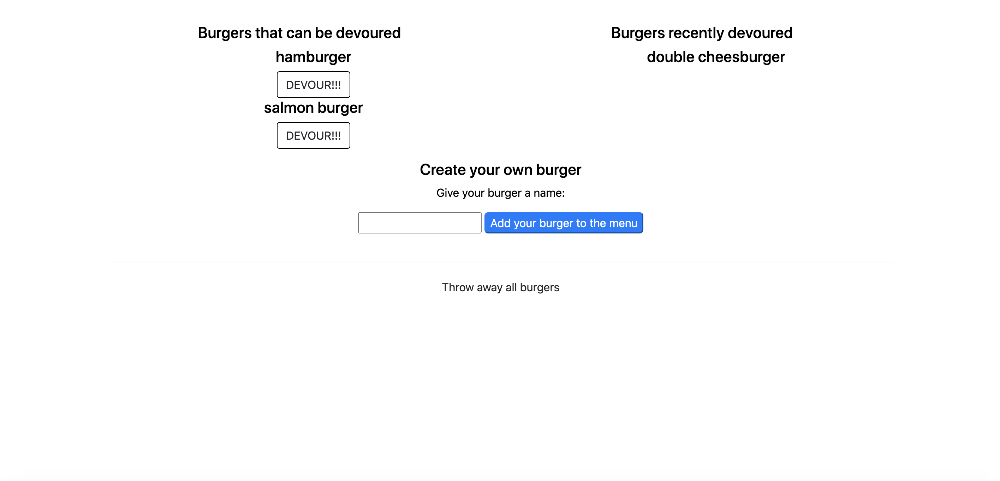

# Node-Express-Handle-Bars-## Description

This application provides the user with the ability to name and create their own burger, to devour any available burgers that have not already been devoured, and to start from scratch and throw away all created burgers. The technologies used are Node.js, Express and mySQL.

**## Table of Contents**

1. [Installation Instructions](#installation-instructions)
2. [Usage Information](#usage-information)
3. [Test Instructions](#test-instructions)
4. [Questions](#questions)

## Installation Instructions

Once you have succesfully cloned the application to your local machine, be sure that all required dependencies for the application are installed by running "npm i". You will also want to connect your local machine to a mySQL database and input the schema.sql file. Without the database connected, this application will not work correctly.

## Usage Information

This application is deployed on Heroku and can be accessed by visiting this link: <a href="https://desolate-everglades-82495.herokuapp.com/">Deployed link</a>

## Test Instructions

There are currently no testing suites for this application.

# Questions

For any questions about this assignment, feel free to reach out to me on github or my email.
Simplyjacob00@gmail.com
https://github.com/Jacob1205/Node-Express-Handle-Bars-
